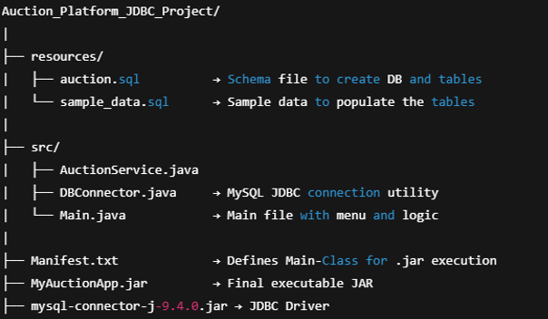

# Auction Platform (JDBC Project)

A terminal-based Java application to simulate an auction platform with MySQL database connectivity using JDBC.

---

## 📁 Project Structure

~

---

## ⚙️ Setup Instructions

### 1. Clone the Repository

You can copy the project folder or run:

```bash
git clone https://github.com/ShivaGupta-14/Auction_Platform_JDBC_Project.git
```

### 2. Create the MySQL Database

Open MySQL CLI or any GUI tool and run:

```bash
SOURCE resources/auction.sql;
SOURCE resources/sample_data.sql;
```

This will create all necessary tables and fill them with demo data.

### 3. Compile the Java Source Files

Run the following command in your terminal:

```bash
javac -d out -cp ".;mysql-connector-j-9.4.0.jar" src/*.java
```

This command:

● Compiles all Java files from the src folder  
● Outputs .class files into the out directory  
● Links the JDBC connector during compilation

### 4. Create the JAR File
```bash
jar cfm MyAuctionApp.jar Manifest.txt -C out .
```

This packages the compiled files into an executable JAR file with the main class defined.

### 5. Run the Application

```bash
java -jar MyAuctionApp.jar
```

● A terminal-based menu will appear where you can:  
● Register sellers and bidders  
● Create auction items  
● Place bids  
● View auction results and reports

---

## 🧰 Tools & Technologies Used
● Java Version: 23.0.1 (build 23.0.1+11-39)  
● MySQL Version: 8.0 or higher  
● JDBC Driver: mysql-connector-j-9.4.0.jar  
● Java VM: Java HotSpot(TM) 64-Bit Server VM  
● Code Editor: Visual Studio Code

## ✅ Project Highlights
● Terminal menu using if-else  
● Modular design with clean separation of logic and database  
● Tested .jar execution  
● At least 10 test records in all major tables  
●All database inputs taken via terminal

## 👤 Author
Shiva Gupta

Profile : https://github.com/ShivaGupta-14
